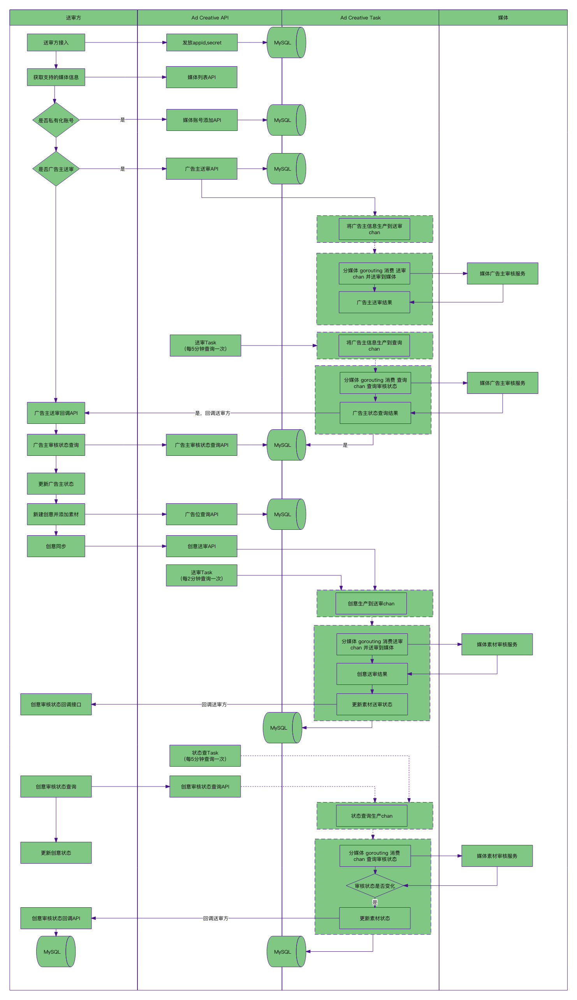

# Ad Creative

> 多客户、多广告主、多媒体广告创意并行送审服务

## 技术栈

- Go 语言
- 框架路由使用 [Gin](https://github.com/gin-gonic/gin) 路由
- 中间件使用 [Gin](https://github.com/gin-gonic/gin) 框架的中间件
- 数据库组件 [GORM](https://github.com/jinzhu/gorm)
- 配置文件解析库 [Viper](https://github.com/spf13/viper)
- 校验器使用 [validator](https://github.com/go-playground/validator.v10)  也是 Gin 框架默认的校验器
- 任务调度 [cron](https://github.com/robfig/cron)
- 包管理工具 [Go Modules](https://github.com/golang/go/wiki/Modules)
- 使用 make 来管理 Go 工程
- 使用 shell(startup.sh) 脚本来管理进程
- 使用 YAML 文件进行多环境配置
- 使用 Ide 自带 [REST Client](https://www.jetbrains.com/help/idea/http-client-in-product-code-editor.html#converting-curl-requests) 工具测试 API
- 使用 Prometheus 监控 QPS、分位耗时、送审状态分布等
- 使用钉钉：送审不通过、送审异常告警

## 数据流


## 目录结构

```
├── cmd                          # 命令行工具
├── Makefile                     # 项目管理文件
├── configs                      # 配置文件统一存放目录
├── docs                         # 框架相关文档
├── internal                     # 业务目录
│   ├── crons                    # 定时任务
│   ├── handler                  # http 接口
│   ├── media                    # 媒体接口具体实现
│   ├── pkg                      # 内部应用程序代码
│   ├── routers                  # 业务路由
│   ├── service                  # 业务逻辑
│   ├── model                    # 数据模型
│   └── task                     # 异步任务
├── logs                         # 存放日志的目录
├── resource                     # 资源目录目录
├── main.go                      # 项目入口文件
├── pkg                          # 公共的 package
├── tests                        # 单元测试
└── startup.sh                   # 服务启动脚本
```

## 快速开始

```bash
# 下载安装，可以不用是 GOPATH
git clone https://github.com/convee/adcreative.git

# 进入到下载目录
cd adcreative

# 生成环境配置文件
cd config

vim dev.yml

# 修改 mysql、redis配置

# 导入 sql


# 编译
make build

# 运行方式（后台运行）
nohup ./adcreative dev.yml &

```

## 常用命令

- make help 查看帮助
- make dep 下载 Go 依赖包
- make build 编译项目
- make tar 打包文件

## 模块

- 第三方接口
- 媒体送审任务
- 管理后台

## 开发规范

遵循: [Uber Go 语言编码规范](https://github.com/uber-go/guide/blob/master/style.md)

## 开发规约

## 部署

```shell
# 1、构建
make build
# 2、打包
make tar 
# 3、上传打包文件到服务器目录
rz -y
# 4、上服务器解压
tar -zxvf adcreative-2022.tar.gz
# 5、部署服务（后台运行）
sh build/startup.sh
# 6、守护进程（supervisor）
[program:material-service]
directory = /data/modules/adcreative
command = /data/modules/adcreativee/adcreative -c configs/prod.yml
autostart = true
autorestart = true
startsecs = 5
user = root
redirect_stderr = true
stdout_logfile = /data/modules/adcreative/supervisor.log

```

## 数据库说明
- [数据表设计](docs/database.md)

## 接口文档

- [第三方接口文档](docs/openapi.md)
- [后台接口文档](docs/backend.md)

## 媒体对接文档
- [腾讯](https://wiki.adx.qq.com/)
- [网易新闻](http://api.nex.163.com/doc.html)
- [UC](https://tanx-media-systest.taobao.com/debugger/readme)